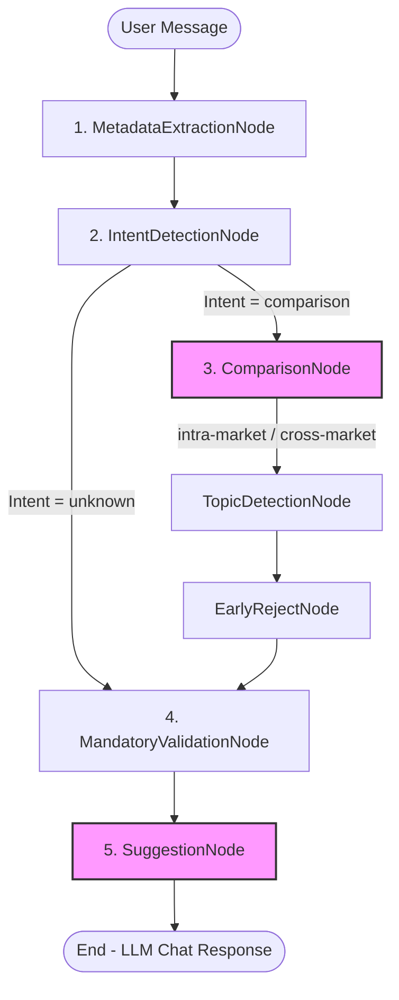

# Hướng dẫn Logic Tải Tài Liệu Hướng Dẫn (Guideline Documents) Từ Văn Bản Bất Kỳ

Tài liệu này hướng dẫn quy trình tổng quát để phân tích văn bản thô của người dùng, xác định các trường thông tin (metadata), theo vết các bước chuyển tiếp qua các Node trong Chat Graph, và tải tài liệu hướng dẫn tương ứng từ local storage.

---

## 🧭 BẢN ĐỒ ĐI QUA CÁC GRAPH NODES (Graph Flow Analysis)

Khi một tin nhắn của người dùng đi vào hệ thống, quá trình xác định và tải tài liệu được điều phối qua các Node chính sau:



### 1. MetadataExtractionNode (Trích xuất Metadata)
*   **Nhiệm vụ:** Nhận diện các giá trị metadata thô (ví dụ: Quốc gia `M0001`, Chủ đề `M0000`, ...) thông qua `tool-100` (regex/rules) hoặc model Local 7B. Các metadata này là cơ sở để định vị thư mục tài liệu ở các node sau.

### 2. IntentDetectionNode (Phát hiện Intent)
*   **Nhiệm vụ:** Phân loại yêu cầu của người dùng để bẻ nhánh luồng đi:
    - Nếu là yêu cầu so sánh (được phân loại là `comparison`): Chuyển tiếp sang **ComparisonNode**.
    - Nếu là câu hỏi thông thường (được phân loại là `unknown`): Đi tiếp luồng thông thường qua **MandatoryValidationNode** và sang **SuggestionNode**.

### 3. ComparisonNode (Tải tài liệu So sánh - Comparison Docs)
*   *Chỉ chạy khi Intent = `comparison`.*
*   **Nhiệm vụ:**
    1.  **So sánh liên quốc gia (cross-market):** Tải tài liệu hướng dẫn của từng quốc gia được yêu cầu so sánh.
    2.  **So sánh trong cùng quốc gia (intra-market):** Phân tích từ khóa trong văn bản để nhận diện các cặp đối chiếu cụ thể (ví dụ: visa dán vs e-visa, single vs multiple entry), tự động build `pair_id` tương ứng.
    3.  **Tải file local:** Gọi `ComparisonDocLoaderTool` để load file markdown.
    4.  **Fallback:** Nếu thiếu file local, ghi nhận log warning: `"ComparisonNode: thiếu docs local..."` và kích hoạt web search/market research.

### 4. MandatoryValidationNode (Xác thực thông tin bắt buộc)
*   **Nhiệm vụ:** Kiểm tra xem các trường thông tin bắt buộc (`M0002` - Mục đích, `M0004` - Diện visa, v.v.) đã được thu thập đủ chưa. Kết quả kiểm tra này được chuyển sang `SuggestionNode`.

### 5. SuggestionNode (Tải tài liệu Gợi ý - Confirmation & Question Docs)
*   *Chạy trong luồng thông thường (General Flow) để chuẩn bị context cho LLM phản hồi.*
*   **Nhiệm vụ:** Gọi `SuggestionService.prepare_suggestion_context` để tải 2 loại tài liệu:
    1.  **Confirmation Docs (Tài liệu xác nhận):** Tải tài liệu đối chiếu cho các trường metadata đã hoàn thành (ví dụ: `M0000_M0001` - giới thiệu chung, `M0001_M0002` - hướng dẫn theo mục đích).
    2.  **Question Doc (Tài liệu đặt câu hỏi):** Nếu thiếu trường mandatory, tải tài liệu chứa câu hỏi gợi mở cho trường thiếu tiếp theo (ví dụ: `M0001_O8001` để hỏi thông tin blacklist).

---

## ⚡ LOGIC PHÂN TÍCH VĂN BẢN VÀ XÁC ĐỊNH PAIR_ID

### Bước 1: Xác định quốc gia/thị trường đích (`country_code`)
Để định vị đúng thư mục chứa tài liệu:
1.  **Lấy từ metadata:** Đọc giá trị trường quốc gia đến (`M0001`) trong state hiện tại.
2.  **Trích xuất từ text:** Nếu chưa có metadata, phân tích các từ quốc gia xuất hiện trong văn bản (ví dụ: "Nhật", "Hàn", "Pháp", "Mỹ") để map sang mã quốc gia tương ứng qua hàm `get_country_code_by_name`.
3.  **Fallback:** Nếu không phát hiện được quốc gia nào, sử dụng mã quốc gia mặc định (ví dụ: `KOR`).

### Bước 2: Nhận diện các Metadata Field liên quan trong văn bản
Phân tích văn bản của người dùng để phát hiện các chủ đề hoặc điều kiện liên quan:
*   Nhận diện các trường bắt buộc (Mandatory): `M0001` (Quốc gia), `M0002` (Mục đích), `M0004` (Diện visa)...
*   Nhận diện các trường điều kiện (Optional/Condition): `O1005` (Công việc), `O5001` (Lịch sử du lịch), `O8001` (Blacklist/Warning), `O9001` (Số lần nhập cảnh), `O9003` (Hình thức nộp)...

### Bước 3: Ghép cặp tạo `pair_id` tài liệu
Các tài liệu hướng dẫn trong hệ thống được quản lý và đặt tên theo định dạng ghép cặp: `[ID_1]_[ID_2]`.
1.  **Quy tắc ghép cặp:** Kết hợp các metadata IDs đã nhận diện được từ text hoặc state hiện tại theo thứ tự ưu tiên (thường là trường quốc gia ghép với trường điều kiện, hoặc các trường điều kiện ghép với nhau).
2.  **Chuẩn hóa thứ tự:** Đảm bảo `pair_id` được sắp xếp theo đúng thứ tự alphabet hoặc quy định đặt tên file trong thư mục lưu trữ (ví dụ: `M0001_O8001` chứ không phải `O8001_M0001`).

### Bước 4: Xây dựng đường dẫn file (Path Building)
Đường dẫn file markdown tài liệu được xây dựng theo cấu trúc chuẩn hóa:
```text
storage/private/market_data/{country_code}/{pair_id}/{pair_id}.md
```

### Bước 5: Thực hiện Tải tài liệu & Xử lý Fallback
1.  **Tải file:** Sử dụng lớp `DocumentLoader` để đọc nội dung file dưới dạng UTF-8.
2.  **Merge Context:** Đưa nội dung tài liệu đã tải vào context của Agent/LLM để phục vụ sinh câu trả lời.
3.  **Xử lý khi thiếu file local:** 
    - Nếu file local không tồn tại, ghi nhận log warning chi tiết để phục vụ giám sát dữ liệu.
    - Kích hoạt cơ chế Fallback (ví dụ: gọi công cụ tìm kiếm Web/Market Research để bù đắp thông tin thiếu hụt hoặc sử dụng nội dung tĩnh mặc định).
